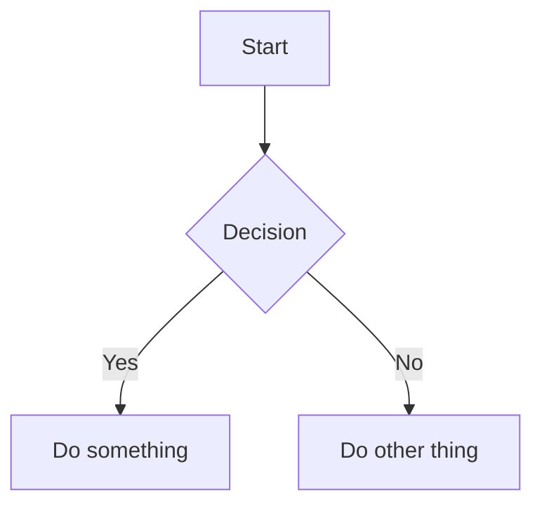

# MDLook — Feature Guide

Everything MDLook can render, with examples you can copy and edit.

---

## Markdown Syntax

### Text Formatting

| Syntax | Result |
|--------|--------|
| `**bold**` or `__bold__` | **bold** |
| `*italic*` or `_italic_` | *italic* |
| `***bold italic***` or `___bold italic___` | ***bold italic*** |
| `++underline++` | underline (MDLook extension) |
| `~~strikethrough~~` | ~~strikethrough~~ |
| `==highlight==` | highlighted text (yellow background) |
| `` `inline code` `` | monospace inline code |

### Paragraphs & Line Breaks

A blank line creates a new paragraph. A single line break (pressing Enter once) renders as a visible line break (`<br>`) within the same paragraph.

```
First line
Second line (same paragraph, visible break)

New paragraph after blank line.
```

### Headings

```
# H1 — document title / top-level section
## H2 — major section
### H3 — sub-section
#### H4 — minor sub-section
##### H5
###### H6
```

All headings become **collapsible sections** in Read mode. Click the heading text or the left border line to toggle. Nested headings collapse hierarchically — collapsing an H2 hides all its H3/H4 children.

### Table of Contents

Write `[TOC]` (or `[toc]`) alone on its own line to insert an auto-generated, collapsible table of contents. It lists all headings as clickable links. Clicking a TOC link auto-expands any collapsed parent sections before scrolling.

```
# My Document

[TOC]

## First Section
### Sub-section
## Second Section
```

### Links & Images

```
[link text](https://url.com)

```

Bare URLs auto-link automatically: `https://example.com` becomes a clickable link.

### Lists

**Bullet list:**
```
- First item
- Second item
- Third item
```

**Numbered list:**
```
1. First step
2. Second step
3. Third step
```

**Task list (checkboxes):**
```
- [ ] Unchecked task
- [x] Completed task
```

**Nested lists** — indent with 2+ spaces:
```
- Parent item
  - Child item
  - Another child
- Back to parent
```

### Blockquotes

```
> Single line quote

> Multi-line quote
> continues here
```

### Horizontal Rule

Any of these on a line by themselves:
```
---
***
___
```

### Tables

```
| Header 1 | Header 2 | Header 3 |
|----------|----------|----------|
| Cell 1   | Cell 2   | Cell 3   |
| Cell 4   | Cell 5   | Cell 6   |
```

Tables render with styled headers, alternating row backgrounds, and horizontal scroll on narrow screens.

### Code Blocks

````
```language
your code here
```
````

Each code block shows the language label and a **Copy** button in the header.

**Supported languages for syntax highlighting:** `js`, `javascript`, `python`, `py`, `css`, `html`, `xml`, `json`, `bash`, `sh`, `sql`, `c`, `cpp`, `java`, `ruby`, `go`, `rust`, `ts`, `typescript`, `php`, `swift`, `kotlin`, `yaml`, `toml`, `ini`, `diff`, `markdown`, `md`, `r`, `lua`, `perl`, `scala`, `dart`, `powershell`.

### Mermaid Diagrams

````

````

Renders as visual diagrams via Mermaid.js. Supports flowcharts (`graph`), sequence diagrams (`sequenceDiagram`), Gantt charts (`gantt`), pie charts (`pie`), class diagrams, state diagrams, and more. Adapts to dark/light theme automatically. Full syntax reference: https://mermaid.js.org

### Math (KaTeX)

**Inline math** — wrap with single `$`:
```
The formula $E = mc^2$ is well known.
```

**Block math** — wrap with `$$` on separate lines:
```
$$
\frac{-b \pm \sqrt{b^2 - 4ac}}{2a}
$$
```

Block math renders centered with display-mode sizing. Uses KaTeX — see https://katex.org/docs/supported for full LaTeX command reference.

### Colored Text

**Token names** (adapt to light/dark theme automatically):
```
{color:pink}adaptive pink text{/color}
{color:green}adaptive green text{/color}
```

**Available tokens:**

| Token | Light theme | Dark theme |
|-------|-------------|------------|
| `pink` | #d63384 | #ff79c6 |
| `green` | #198754 | #50fa7b |
| `purple` | #6f42c1 | #bd93f9 |
| `orange` | #c96442 | #ffb86c |
| `cyan` | #0a8c9e | #8be9fd |
| `red` | #dc3545 | #ff5555 |
| `yellow` | #a87d04 | #f1fa8c |
| `blue` | #0d6efd | #89b4fa |

**Fixed colors** (same in both themes):
```
{color:#ff79c6}hex color{/color}
{color:red}CSS named color{/color}
{color:rgb(80,250,123)}rgb color{/color}
```

### Color Swatches

Any `#hex` code in text auto-renders a small colored square inline before the code. Works with 3, 6, or 8-digit hex values.

```
The accent color is #c96442 and the background is #f5f4f0.
```

### Footnotes

**Reference in text** — use `[^id]` where id is a number or name:
```
This claim needs a source[^1]. Another reference[^note].
```

**Definition** — place anywhere in the document (removed from flow, rendered at bottom):
```
[^1]: Full source citation here.
[^note]: Explanation of the referenced concept.
```

Renders superscript linked numbers in text and a "Footnotes" section at the document bottom with back-links (↩).

### Escaping Special Characters

Prefix with backslash to render literally:
```
\*not italic\*
\# not a heading
\[not a link\]
```

---

## App Features

### Keyboard Shortcuts

| Shortcut | Action | Mode |
|----------|--------|------|
| `Ctrl + 1` | Read mode | All |
| `Ctrl + 2` | Edit mode (split-pane) | All |
| `Ctrl + 3` | Source mode (raw HTML) | All |
| `Ctrl + B` | Bold | Edit |
| `Ctrl + I` | Italic | Edit |
| `Ctrl + U` | Underline | Edit |
| `Ctrl + Shift + X` | Strikethrough | Edit |
| `Ctrl + Shift + H` | Highlight | Edit |
| `Ctrl + S` | Save file | Edit |
| `Ctrl + F` | Find | All |
| `Esc` | Exit Zen mode / close panel | All |
| `Space` | Teleprompter: pause / resume | Read (when active) |
| `↑` / `↓` | Teleprompter: speed ±1 | Read (when active) |
| `Shift+↑` / `Shift+↓` | Teleprompter: speed ±10 | Read (when active) |

### Editor Toolbar

The Edit mode toolbar provides one-click buttons for: Bold, Italic, Underline, Strikethrough, Highlight, Color (A button with palette), Inline code, Code block, Link, Image, Bullet list, Numbered list, Task list, Blockquote, Horizontal rule, Table, Heading (H1–H4).

The top bar also includes: **Open** (browse for `.md` file), **Export** (HTML or Print/PDF), **Save** (save edited file to disk), **?** (Help & Changelog), theme toggle, and Zen mode.

### Collapsible Sections

In Read mode, every heading wraps its content in a collapsible section. Visual indicators:

- **▸ triangle** before heading — click to toggle
- **Left border line** — click anywhere on it to toggle
- **Dashed orange border** — indicates collapsed state
- **Badge** — shows hidden content count, e.g. "(3 blocks)"
- **▲ All / ▼ All buttons** — collapse or expand every section at once (top-right corner)

### Outline Panel

Click the **☰** button (top-right in Read or Edit mode) to open the outline sidebar. Lists all headings as a clickable navigation tree. In Read mode, clicking an outline item auto-expands any collapsed parent sections. In Edit mode, the outline updates live as you type and clicking scrolls the preview pane to the heading.

### Context Menu

Right-click anywhere in Read or Edit mode to open a custom context menu with quick actions (Copy, Select All, and formatting options in Edit mode). The default context menu is replaced by a custom one throughout the app.

### Dark / Light Theme

Click the **🌙/☀️** button in the top bar to toggle themes. All colors — including color tokens, Mermaid diagrams, code blocks, and UI elements — adapt automatically.

### Drag & Drop Images

In Edit mode, drag an image file onto the editor to insert a `` block with the image embedded as base64.

### Export HTML

Click the **⤓** button to export the rendered document as a standalone HTML file with all styles, fonts, KaTeX, and Mermaid included.

### Zen Mode

In Edit mode, click the **Zen** button to hide the preview pane and focus on writing. Press `Esc` to exit.

### Teleprompter

In Read mode, click **▶ Auto** in the right sidebar to start auto-scrolling. A floating control bar appears at the bottom with speed adjustment (1–100), pause/resume, and stop. Keyboard: `Space` to pause/resume, `↑`/`↓` for fine speed adjustment (±1), `Shift+↑`/`Shift+↓` for coarse (±10), `Esc` to stop. Default speed is 5 (comfortable reading). Stops automatically at the end of the document.

### Split-Pane Divider

In Edit mode, drag the center divider to resize editor/preview panes. **Double-click** the divider to reset to 50/50.

### Find

Press `Ctrl+F` to open the Find bar. Highlights all matches and lets you navigate between them with arrow buttons or `Enter` / `Shift+Enter`. Works across Read, Edit, and Source modes.

### Windows Integration

**Open a file:** Drag a `.md` file onto `MDLook.exe`, or double-click any `.md` file after associating it.

**Standalone mode:** Run `MDLook.exe` to open with an empty editor. Use the **Open** button in the toolbar to browse and load a `.md` file.

**File association:** Right-click the system tray icon → "Associate .md files" to register MDLook as the default handler for `.md` files with a custom document icon.

**Start with Windows:** Right-click the tray icon → "Start with Windows" to launch MDLook silently at boot.

### Unsaved Changes Warning

The app warns before closing or navigating away if you have unsaved edits in the editor.
